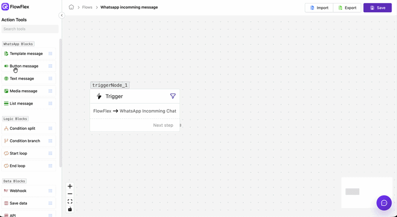
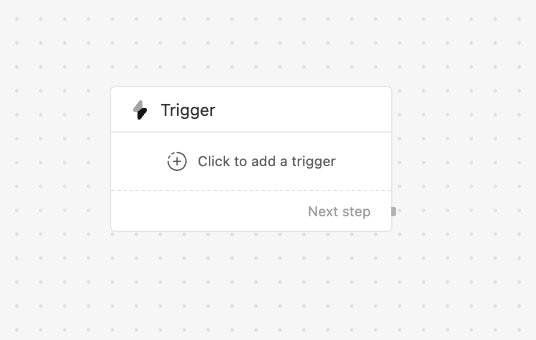
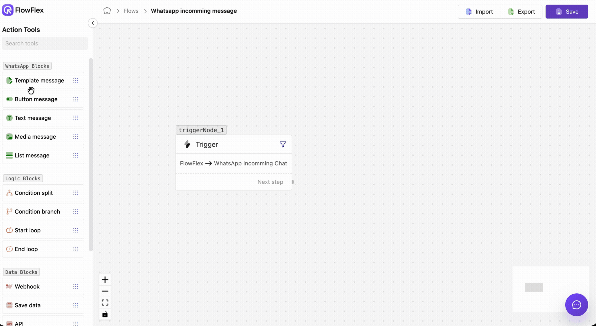
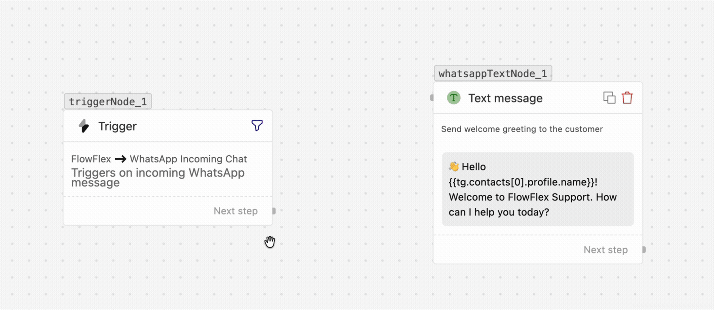

# Building a flow

The **flow builder** is a drag-and-drop canvas where you lay out the steps of an
automation. You drag **nodes** from the toolbox, connect them with **edges**, and
configure each one in a side drawer. This page walks you through building a flow end to
end. For what every node does, see the [Node reference](flows/nodes.md).

## The builder at a glance

The builder has three areas:

- **Toolbox** (left) — the palette of nodes, grouped into WhatsApp, Logic, Timing and Data.
- **Canvas** (center) — where you place and connect nodes. Pan by dragging the background;
  zoom with the scroll wheel or the zoom controls.
- **Config drawer** (right) — opens when you click a node, for setting it up.
- **Top bar** — **Save**, **Publish**, and (on localhost builds) **Test**.

## 1. Start with the trigger

Every flow begins with a single **Trigger** node — it's already on the canvas when you
start. Click it and choose the event that should start this flow (e.g. your
custom-integration event `order.placed`). The trigger exposes the event payload to every
later node as `{{trigger.*}}` — see [Triggers & variables](flows/triggers-and-variables.md).

## 2. Add a node from the toolbox

Find the node you want in the toolbox and **drag it onto the canvas**. Nodes are grouped by
type (WhatsApp messages, Logic, Timing, Data) so related steps are easy to find.

## 3. Connect nodes with edges

Each node has one or more **handles** — the small dots on its edges. Drag from a node's
handle to the next node to draw an **edge**. The edges decide the **order** the flow runs in
and which path each branch takes.

- Most nodes have a single **Next step** handle.
- **Button** and **List** nodes have one handle per button/row, plus a **No response** handle.
- **Condition** nodes have a handle per path (Yes/No, or each branch + a default).
- An unconnected handle simply **ends that path**.

## 4. Configure a node

Click a node to open its **config drawer**. Fill in its settings — message body,
destination number, condition, delay, and so on. Any text field accepts `{{…}}` variables:
click **Insert Variable** to pick a field from the trigger payload (or an earlier node's
output) instead of typing the path by hand.

## 5. Save and publish

**Save** keeps your work in progress. **Publish** makes the flow live so it runs whenever
its trigger event fires. Until a flow is published, firing the event won't start it.

## Tips

- **Build the happy path first**, then add branches (conditions, No-response) once it works.
- **Always wire the No-response path** on anything that waits for a reply, so a silent
  customer doesn't leave the flow stuck. See [Waiting for a reply](flows/response-wait.md).
- **Personalize with variables** everywhere via **Insert Variable** — it only offers fields
  your trigger's sample payload actually contains.
