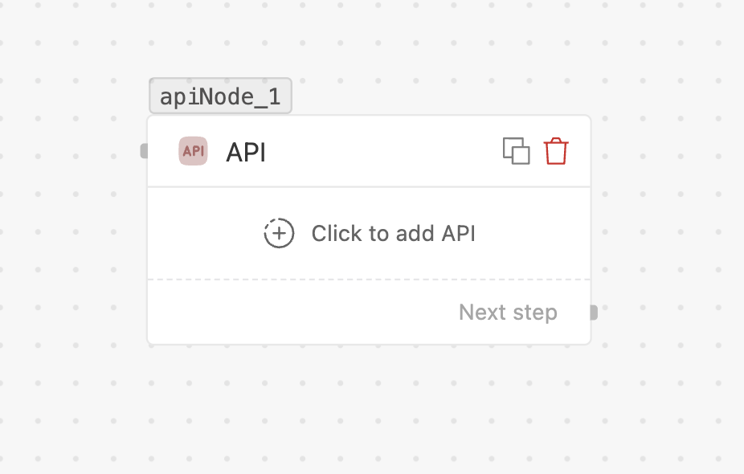

# API

> Call an external HTTP API mid-flow and use its response in later nodes.

## What it does

Makes an HTTP request to any URL and captures the response so downstream nodes can use it
(e.g. to look up data, then branch or message based on what comes back).

## When to use

- Fetching live data mid-flow: order status, stock, a customer record, a price.
- Triggering an action in another system.

## Settings

| Field | Required | Notes |
| --- | --- | --- |
| **Method** | Yes | **GET, POST, PUT, PATCH, DELETE**. |
| **URL** | Yes | The endpoint. Supports `{{variables}}`. |
| **Headers** | No | Key/value pairs; values accept `{{variables}}`. |
| **Query parameters** | No | Key/value pairs appended to the URL. |
| **Body** | POST/PUT/PATCH | Key/value pairs sent as the request body. |

> [!NOTE]
> For headers, query params, and body, the **key** name may only contain letters and hyphens
> (`A–Z`, `a–z`, `-`) — digits and underscores are rejected. Values accept `{{variables}}`.
| **Sample payload** | No | Paste an example response so the **Insert Variable** picker knows the fields you can use later. |

> [!NOTE]
> Provide a **sample payload** of the response. That's what lets later nodes reference the
> returned fields as variables — without it, the picker has nothing to offer.

## Handles

- **Next step** — runs after the request completes; the response is available to later nodes.

## Tips

- Reference the response in later nodes via the node's output (use **Insert Variable**).
- Keep secrets in headers/variables, not hard-coded in the URL.
