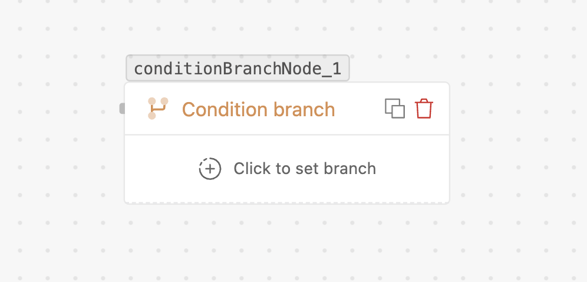

# Condition branch

> A **multi-path** branch — the flow takes the **first** path whose condition matches, or a
> **default** path if none do.

## What it does

Like a switch statement: you define several **paths**, each with its own condition. The flow
evaluates them **top to bottom** and takes the **first** one that matches. If none match, it
takes the **default** path.

## When to use

- More than two outcomes: routing by category, tier, region, status, or a menu selection.

## Settings

- **Paths** — starts with two ("Path 1", "Path 2"); add as many as you need.
- **Per path** — a label and its condition(s), combined with **AND** / **OR** (same
  [operators](flows/nodes/condition-split.md#settings) as Condition split).
- **Default** — the fallback path when nothing matches.

## Handles

- **One handle per path** — wire each to its branch.
- **Default** — taken when no path matches. Wire it so unmatched cases aren't dropped.

## Tips

- **Order matters** — the first matching path wins, so put the most specific conditions first.
- **Always wire the default** so unexpected values still go somewhere.
