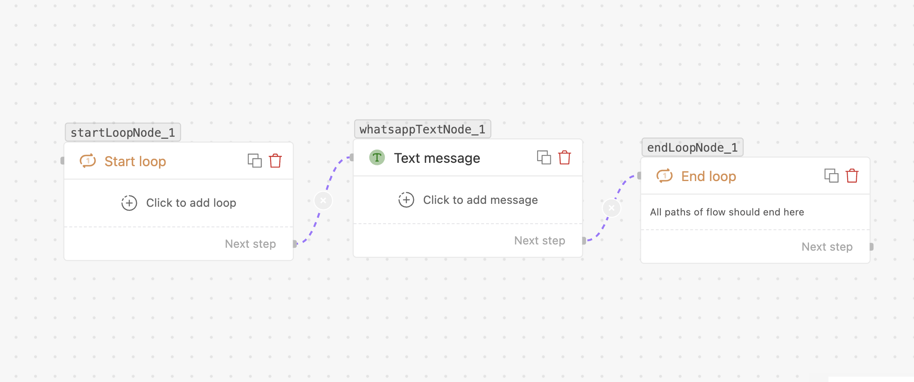

# For loop

> Repeat a set of steps — over each item in a list, or a fixed number of times.

## What it does

Runs the steps placed **between a Start loop and an End loop** node repeatedly — once per item
in a list, or a fixed number of times. Inside the loop, the current item and position are
available as variables.

## When to use

- Sending a message **per item** in an order (`{{trigger.items}}`).
- Repeating an action a set number of times.

## How it works on the canvas

A loop requires **two** nodes placed on the canvas:

1. **Start loop** — configure which list to iterate over; nodes after this are the loop body.
2. **End loop** — marks the boundary; when a loop body completes, execution jumps back to Start loop for the next item.

Nodes wired **between** Start loop and End loop are repeated once per item. Nodes wired **after** End loop run once, after all iterations finish.

## Settings (Start loop node)

| Field | Required | Notes |
| --- | --- | --- |
| **Specify list** | Yes | An array variable, e.g. `{{trigger.items}}`. Must be a variable; literal arrays are not supported. |
| **Limit the loop** | No | Checkbox to cap how many iterations run. |
| **Loop limit** | When limit is on | Maximum number of iterations (≥ 1). Only items up to this count are processed even if the array is larger. |

### Loop variables

Inside the loop body you can reference:

- **`{{loop.item}}`** — the current array element (object, string, number — whatever the array contains).
- **`{{loop.index}}`** — the current position, 0-based.

## Handles

- **Start loop** has one outgoing path — into the loop body.
- **End loop** has one outgoing path — the "after loop" continuation.

## Tips

- Always point `loop_list` at a **variable** that resolves to an array (`{{trigger.items}}`, `{{apiStep.data.results}}`, etc.).
- Use the **Loop limit** to guard against unexpectedly large lists — e.g. cap at 10 so a customer with 500 orders doesn't trigger 500 messages.
- Keep per-iteration messaging mindful of WhatsApp rate/spam limits.
