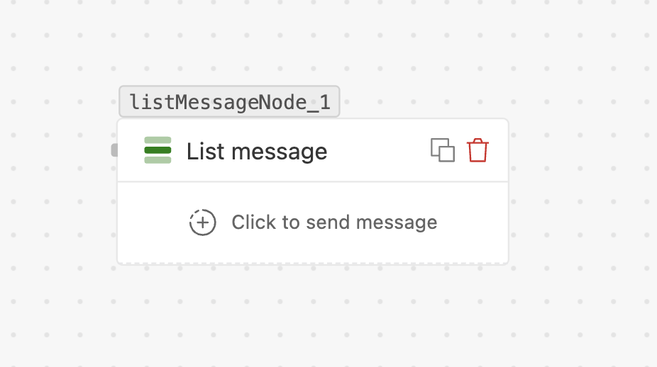

# List message

> An interactive **selectable list** — branch on the row the customer picks. Use it when you
> need more than 3 options.

## What it does

Sends a message with a button that opens a **selectable list**. The list is organised into
**sections**, each with **rows**. Each row is its own outgoing path, so the flow branches on
the row the customer selects. Like buttons, it **waits** for the selection.

## When to use

- Menus with **more than 3 options** (where buttons don't fit).
- Pick-from-a-list choices: products, branches, time slots, categories.

## Settings

| Field | Required | Limit | Notes |
| --- | --- | --- | --- |
| **Destination number** | Yes | — | Recipient with country code. |
| **Header text** | No | 60 chars | Optional title row. |
| **Body** | Yes | — | The message text. |
| **Footer** | No | 60 chars | Small text under the body. |
| **List / button title** | Yes | 24 chars | The label on the button that opens the list. |
| **Sections** | Yes | up to **10** | Each section has a **title** (max 24 chars). |
| **Rows** | Yes | up to **10 total** | Across all sections. Each row: **title** (max 24) and **description** (max 72, required). IDs auto-assigned (`ROW_<section>.<row>`). |

## Handles

- **One handle per row** — wire each to the path for that selection.
- **No response** — taken if the customer doesn't pick within the wait window.

## Tips

- The hard caps are **10 sections** and **10 rows total** — plan groupings accordingly.
- The **row description** is required — use it to clarify each choice.
- For 3 options or fewer, a **[Button message](flows/nodes/button-message.md)** is simpler.
