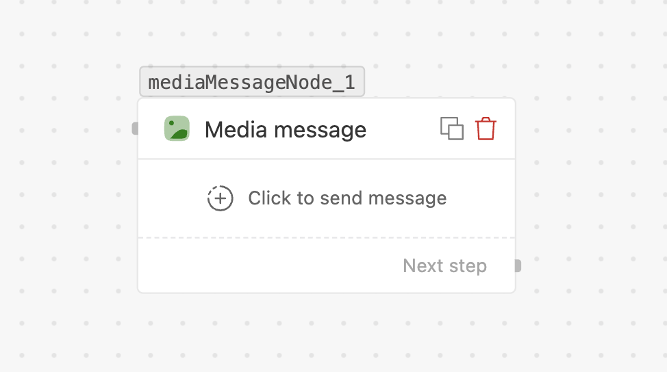

# Media message

> Send an **image, video, document or audio** file — or share a **location** or **contacts**.

## What it does

Sends a media attachment over WhatsApp. Pick the **media type**, then provide the file (by URL
or by `assetId`). It can also send a **location** pin or one or more **contact cards**.

## When to use

- Sending invoices, receipts, tickets (documents), product shots (images), promos (video).
- Sharing a store **location**, or pushing **contact cards** to the customer.

## Settings

| Field | Required | Notes |
| --- | --- | --- |
| **Destination number** | Yes | Recipient with country code. |
| **Media type** | Yes | **image**, **video**, **document**, **audio**, **location**, or **contacts**. |
| **File source** | Yes (file types) | **Public URL** or **Private file (assetId)**. |
| **Media URL / Asset ID** | Yes (file types) | The `https://…` URL, or the `assetId` (e.g. `{{trigger.invoice}}`). |
| **Caption** | No | For image / video only. |
| **Location fields** | If type = location | Name, address, latitude, longitude. |
| **Contacts** | If type = contacts | Up to **10** contacts (name, org, phones, emails, websites, address). |

**Supported file types:** image (jpg, jpeg, png), video (mp4, 3gp), audio (aac, amr, mp3, m4a,
mp4, ogg), document (pdf, doc, docx, xls, xlsx, ppt, pptx, txt). The node validates the file
**extension** against this list. WhatsApp additionally caps media at roughly **25 MB** (that
limit is enforced by WhatsApp, not the node).

### Public vs Private (assetId)

- **Public** — any publicly reachable URL (`{{trigger.invoice_url}}` or a pasted `https://…`).
- **Private (assetId)** — a file uploaded via the [SDK](sdk/files.md) / [API](api/assets.md);
  reference the `assetId`. The bytes never pass through the app server. See
  [Files as variables](flows/triggers-and-variables.md#files-as-variables).

## Handles

- **Next step** — the normal continuation (plus **No response** if *Wait for reply* is on).

## Tips

- For files you generate per-customer, send them via `ff.file(...)` in the
  [SDK](sdk/files.md) and reference the `assetId` here — don't expose a public URL.
- `assetId`s expire after 48h; upload and fire the event close together.
