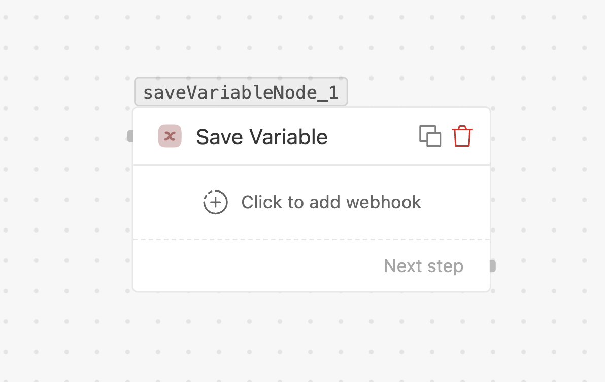

# Save variable Coming soon

> Store one or more named values so later steps can reuse them.

> [!ATTENTION]
> **Not yet live.** The Save variable node can be configured and placed on the canvas, but its
> **execution isn't wired up** — values will not be stored when the flow runs. This page
> describes the intended behavior.

## What it will do

Save one or more key–value pairs for later steps to read. Unlike
**[Save data](flows/nodes/save-data.md)** (which writes rows to a data table), Save variable
holds values in the flow's own working memory for the duration of the run — useful for
stashing a computed or captured value you need in several downstream steps.

## Settings

Each node can hold **multiple variables**. For every entry:

| Field | Notes |
| --- | --- |
| **Variable name** | An identifier for the value. Must start with a letter; only letters, numbers, and underscores are allowed. |
| **Value** | A literal string or a `{{variable}}` expression. Use **Insert Variable** to pick from the flow context. |

Click **Add variable** to add more name–value pairs in the same node.

## Using the variables downstream

Once the node executes, later nodes can reference stored values by name through the
**Insert Variable** picker.

## Variable name rules

- Must start with a letter (A–Z, a–z).
- Can contain letters, numbers, and underscores (`_`).
- No spaces or other special characters.

## In the meantime

- To persist values for reporting or later retrieval, use the **[Save data](flows/nodes/save-data.md)**
  node (it writes to a data table).
- Values from earlier nodes (a captured reply, an API response) are already available
  downstream via **Insert Variable** — see [Triggers & variables](flows/triggers-and-variables.md).
