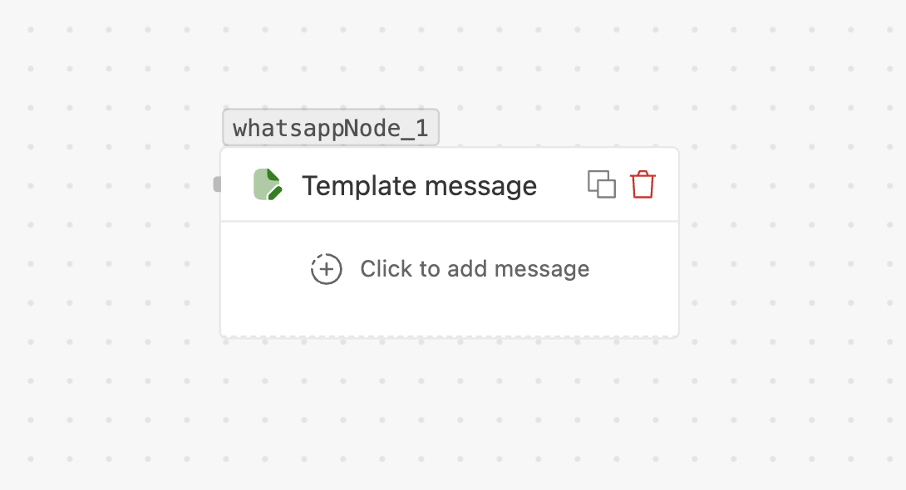

# Template message

> Send a pre-approved WhatsApp **template** — the way to start a conversation outside the
> 24-hour window.

## What it does

Sends one of your **approved WhatsApp message templates** by name and fills in its variables.
Templates are the only way to message a customer **outside the 24-hour session window**
(business-initiated messages).

## When to use

- **Re-engaging** a customer after the 24h window (the most common reason).
- Standardised, approved messaging — order updates, OTPs, reminders, marketing.

## Settings

| Field | Required | Notes |
| --- | --- | --- |
| **Destination number** | Yes | Recipient with country code, e.g. `{{trigger.phone}}`. |
| **Template** | Yes | Pick an **approved** template. Filter by category: **Marketing**, **Utility**, **Authentication**. |
| **Body variables** | If the template has them | Fill each placeholder (`{{1}}`, `{{2}}`, …) with text or a `{{variable}}`. |
| **Header** | If the template has one | Type can be **text, image, video, document, or location** — supply the value/media. |
| **Button URL variables** | If the template has dynamic-URL buttons | Fill the URL parameter for each. |
| **Copy-code / verification code** | For Authentication templates | The OTP / copy-code value. |
| **Wait for specific time** | No | Toggle on to pause for a reply. Set a **unit** (seconds / minutes / hours / days) and **value**. |

> [!NOTE]
> Templates must be **created and approved** in WhatsApp before they appear here. The picker
> only lists approved templates.

## Handles

- **Next step** — the normal continuation.
- **No response** — appears when *Wait for reply* is on.

## Tips

- If a customer recently messaged you (within 24h), a plain
  **[Text message](flows/nodes/text-message.md)** is simpler — no template needed.
- Match the **category** to the use case; Marketing templates have stricter delivery rules.
