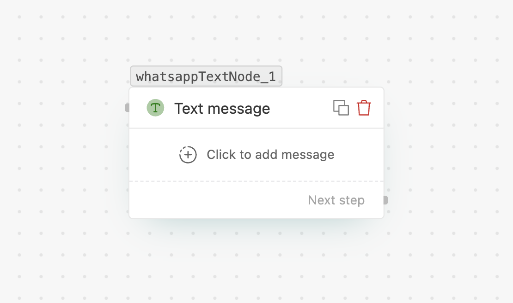

# Text message

> Send a free-form WhatsApp text message — the most common node in a flow.

## What it does

Sends a plain WhatsApp text message to the customer. The body is free-form, supports
variables, and can be formatted. Optionally, the node can **wait for the customer's reply**
before the flow continues.

> [!NOTE]
> Free-form text can only be sent **inside the 24-hour customer-service window** (i.e. within
> 24 hours of the customer's last message). To start a conversation outside that window, use a
> **[Template message](flows/nodes/template-message.md)** instead.

## When to use

- Confirmations, updates, reminders, and replies **during an active conversation**.
- Any message where you want plain text rather than buttons, a list, or media.
- When you want to **wait for a reply** and branch on whether one arrives.

## Settings

| Field | Required | Notes |
| --- | --- | --- |
| **Destination number** | Yes | The recipient, with country code — usually a variable like `{{trigger.phone}}`. |
| **Message body** | Yes | Free-form text. Supports **bold**, _italic_, ~strike~ and `{{variables}}` via **Insert Variable**. |
| **Wait for specific time** | No | Toggle on to pause for a reply. Set a **unit** (seconds / minutes / hours / days) and **value**. |
| **Check format** | No | Only available when *Wait for specific time* is on. Require the reply to match a specific type — see [Waiting for a reply](flows/response-wait.md). |
| **Invalid response text** | No | Message sent back when the customer's reply fails format validation. Defaults to "Please provide a valid response". |

## Handles

- **Next step** — the normal continuation.
- **No response** — appears when *Wait for specific time* is on; taken if no reply arrives in the window.

## Tips

- Keep the **destination number** a variable so the same flow works for every customer.
- Use **Insert Variable** instead of typing `{{…}}` by hand — it guarantees a valid path.
- Wire the **No response** path for anything important. See [Waiting for a reply](flows/response-wait.md).
