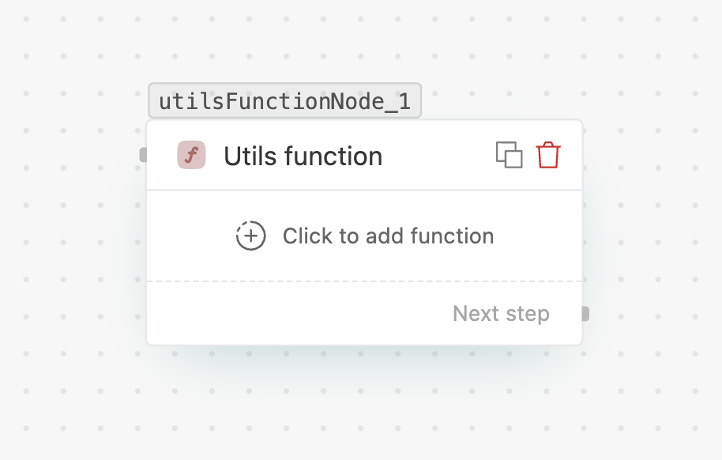

# Utils function

> Run a built-in utility and use its result to branch or personalize downstream.

## What it does

Runs a ready-made helper and exposes its result to later nodes. Today the available function
is **Calculate distance**.

## Available functions

### Calculate distance
Computes the distance between a **source** location and a **target** location (one of your
configured branches). Use the result to branch on proximity — e.g. route a customer to the
nearest store.

| Field | Notes |
| --- | --- |
| **Function** | Select **Calculate distance**. |
| **Source latitude / longitude** | The source point — usually `{{variable}}`s from the payload. |
| **Target branch** | Pick a branch; its stored location is used as the target. |

## Handles

- **Next step** — runs after the result is computed; the distance is available downstream.

## Tips

- Combine with a **[Condition split](flows/nodes/condition-split.md)** to act on the distance.
- More utility functions may be added over time; the picker lists what's available.
